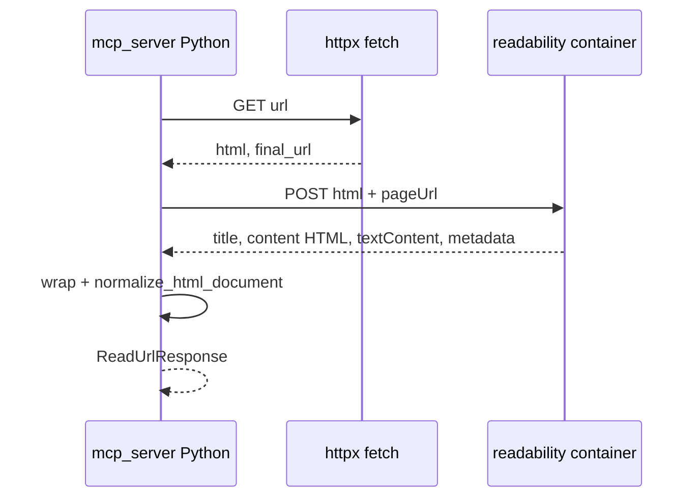

# План: чтение URL через Mozilla Readability в отдельном контейнере

## Контекст

- Сейчас цепочка: [`mcp_server/tools/read_url.py`](d:\web_search_mcp\mcp_server\tools\read_url.py) → [`read_url_document`](d:\web_search_mcp\mcp_server\url_reader.py) → `fetch_html_document` (httpx) → [`normalize_html_document`](d:\web_search_mcp\mcp_server\url_reader.py) (BeautifulSoup + эвристики `main`/`article`).
- Цель: вынести извлечение «тела статьи» в JS ([Readability](https://github.com/mozilla/readability) рассчитан на DOM в духе Firefox Reader View), общаться с ним из Python по HTTP из того же docker-compose, что и [`docker-compose.yml`](d:\web_search_mcp\docker-compose.yml).

## Архитектура

**Почему HTML передаёт из Python, а не качает Node:** повторно используются лимиты, ретраи, `User-Agent`, `VERIFY_SSL` и проверки из [`fetch_html_document`](d:\web_search_mcp\mcp_server\url_reader.py); `pageUrl` в теле запроса нужен для jsdom/Readability, чтобы корректно резолвить относительные ссылки (как в README Readability).

## 1. Сервис Readability (новая папка, например `readability_service/`)

- **Стек:** Node 20+ Alpine, зависимости: `@mozilla/readability`, `jsdom`. По желанию **`isomorphic-dompurify` + `jsdom`** (или аналог) для санитизации фрагмента перед отдачей наружу — в [документации Readability](https://github.com/mozilla/readability) явно рекомендуют санитайзер для недоверенного HTML.
- **HTTP API:** один endpoint, например `POST /extract`, JSON body: `{ "html": string, "pageUrl": string }`.
- **Логика:** `new JSDOM(html, { url: pageUrl })` → `new Readability(document.cloneNode(true)).parse()` (клон, чтобы не мутировать исходный документ попусту).
- **Ответ:** JSON с полями, нужными MCP: минимум `title`, `content` (HTML строка артикля), `textContent`, `excerpt`, `byline`, `siteName`, `publishedTime`, `lang`; при `parse() === null` — явная ошибка в теле (4xx/200 с `{ "ok": false, "error": "..." }` — зафиксировать один стиль).
- **Ограничения:** лимит размера тела (например совпадающий порядок с `URL_READ_MAX_BYTES` или чуть меньше), таймаут обработки на уровне сервера.
- **Dockerfile:** многостадийно не обязательно; `WORKDIR`, `COPY package*.json`, `npm ci --omit=dev`, `COPY .`, `CMD ["node", "server.js"]`, `EXPOSE` внутренний порт.

## 2. Python-обёртка

- **Новый модуль** (например [`mcp_server/readability_client.py`](d:\web_search_mcp\mcp_server\readability_client.py)): `async def extract_article(*, html: str, page_url: str) -> ReadabilityArticle | None` через `httpx.AsyncClient` с таймаутом из настроек (отдельный env или переиспользование `url_read_timeout_seconds`).
- **Конфиг:** в [`mcp_server/config.py`](d:\web_search_mcp\mcp_server\config.py) добавить, например, `readability_service_url: str | None` из `READABILITY_SERVICE_URL` (пусто/`None` = сервис выключен).
- **Интеграция в [`read_url_document`](d:\web_search_mcp\mcp_server\url_reader.py):**
  - Если URL задан: после `fetch_html_document` вызвать клиент; при успехе собрать **синтетический HTML**: `<html><head><title>...</title></head><body><main>{article.content}</main></body></html>` (экранирование title), затем вызвать существующий `normalize_html_document` с `final_url` из фетча и `title` из ответа Readability можно передать приоритетно (перезаписать после normalize или прокинуть опциональный `preferred_title` в normalize — минимальный дифф предпочтителен: одна небольшая правка в `normalize_html_document` или подмена `title` в dict перед `ReadUrlResponse`).
  - Если сервис выключен или запрос к нему не удался: **текущее поведение без изменений** (чистый BeautifulSoup-путь), чтобы локальные запуски без Docker не ломались.
- **Опционально (уточнение продукта):** отдельный флаг инструмента `use_readability: bool` или отдельный tool — если нужно явно выбирать режим с клиента; иначе достаточно «включено, если задан `READABILITY_SERVICE_URL`».

## 3. Docker Compose и MCP-образ

- В [`docker-compose.yml`](d:\web_search_mcp\docker-compose.yml): сервис `readability` (build из `readability_service/`), порт только внутри сети; `mcp-web-search` → `depends_on: readability`, переменная `READABILITY_SERVICE_URL=http://readability:<PORT>`.
- [`mcp_server/Dockerfile`](d:\web_search_mcp\mcp_server\Dockerfile) менять не обязательно (Python-образ остаётся прежним).

## 4. Тесты

- Юнит-тест клиента: замокать `httpx` transport, проверить разбор JSON и ошибки.
- Интеграционный тест опционально: `@pytest.mark.integration` с поднятым контейнером или пропуск по env.
- Существующие тесты [`tests/test_read_url_tool.py`](d:\web_search_mcp\tests\test_read_url_tool.py) должны проходить без `READABILITY_SERVICE_URL` (ветка по умолчанию).

## Риски и ограничения

- Readability иногда возвращает `null` — нужно сообщение уровня текущего `UrlReadResponseError` и при желании fallback на старый пайплайн (можно вынести в env `READABILITY_FALLBACK_ON_FAILURE`).
- Качество markdown по-прежнему задаётся Python-слоем; улучшение «главного» извлечения — за счёт Readability, а не замены конвертера.
