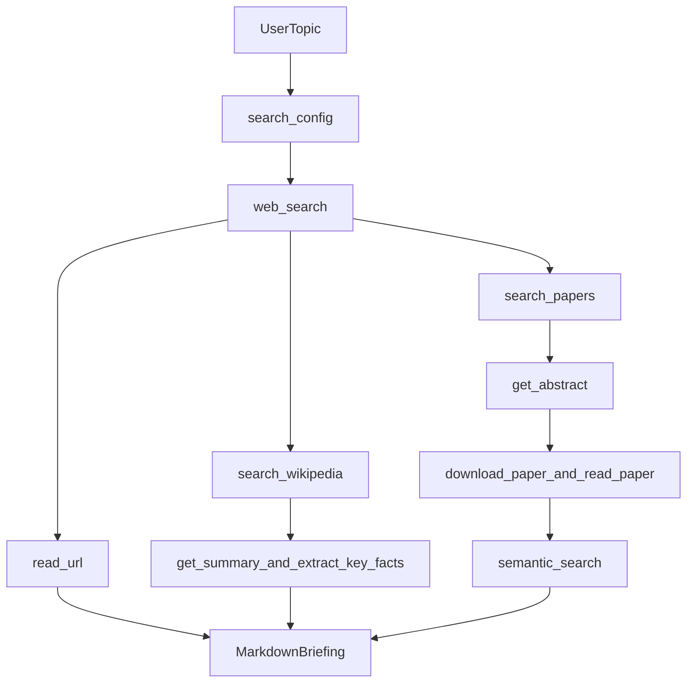

# Researcher Agent Pattern

This guide shows how to use the toolkit as a deep-research agent that
investigates a user-provided topic and returns a Markdown briefing. Start with
the [README Quick Start](../../README.md#quick-start) to run the three MCP
servers, then use this pattern to combine broad discovery, concept grounding,
and paper-backed evidence in one workflow.

## When To Use This Pattern

Use this agent when you want one report that combines:

- broad web discovery
- source reading from selected pages
- concept grounding and terminology checks
- academic evidence from arXiv
- a final Markdown briefing that another human or agent can continue from

## Required MCP Servers

| Server name | Default URL | Role | Core tools |
| --- | --- | --- | --- |
| `general-web-tools` | `http://localhost:8000/mcp` | broad discovery and source reading | `search_config`, `web_search`, `read_url` |
| `wikipedia-research` | `http://localhost:8001/mcp` | canonical terms, summaries, and key facts | `search_wikipedia`, `get_summary`, `get_article`, `extract_key_facts` |
| `arxiv-research` | `http://localhost:8002/mcp` | paper search, abstract review, full paper reading, and local semantic follow-up | `search_papers`, `get_abstract`, `download_paper`, `read_paper`, `semantic_search`, `list_papers` |

## Tool Routing Strategy

| Research need | Endpoint | Tools | Outcome |
| --- | --- | --- | --- |
| Discover which web search categories and engines are available | General | `search_config` | instance-aware query planning |
| Map the topic and find candidate sources | General | `web_search` | source shortlist across multiple angles |
| Read the most useful sources | General | `read_url` | normalized page content for analysis |
| Resolve names, concepts, and background context | Wikipedia | `search_wikipedia`, `get_summary`, `extract_key_facts` | cleaner terminology and fewer false assumptions |
| Find relevant papers | ArXiv | `search_papers`, `get_abstract` | shortlist of papers worth deeper reading |
| Inspect downloaded papers and answer focused subquestions | ArXiv | `download_paper`, `read_paper`, `semantic_search` | evidence from full paper content |

## Recommended Workflow

1. Call `search_config` once at the start so the agent knows which categories
   and engines are exposed by the current general endpoint.
2. Run multiple `web_search` queries that cover the topic from different
   angles: overview, latest developments, primary actors, and limitations.
3. Use `read_url` on the strongest sources. Prefer original publishers,
   maintainers, standards bodies, research labs, or official company posts when
   available.
4. Use the Wikipedia endpoint to confirm naming, retrieve concise summaries, and
   extract key facts before writing conclusions.
5. Use the arXiv endpoint to search for papers, inspect abstracts, and download
   only the most relevant papers for deeper reading.
6. If multiple papers are downloaded, use `semantic_search` to answer focused
   subquestions without re-reading everything manually.
7. Produce a Markdown report that clearly separates facts, interpretation,
   uncertainty, and open questions.



## Copy/Paste Agent Prompt

Use the following prompt as a starting point for an agent that should research
any topic and return a Markdown briefing.

```text
You are a researcher agent working with three MCP servers:
- `general-web-tools`
- `wikipedia-research`
- `arxiv-research`

Research topic: <TOPIC>
Audience: <AUDIENCE>
Depth: <DEPTH>
Recency focus: <TIME_HORIZON>

Workflow requirements:
1. Start with `search_config` on `general-web-tools`.
2. Use `web_search` to map the topic from multiple angles.
3. Use `read_url` on the strongest primary or high-signal secondary sources.
4. Use Wikipedia to confirm names, terminology, and key facts.
5. Use arXiv to identify relevant papers. Read abstracts first. Download and
   read full papers only when they are clearly relevant to the topic.
6. If multiple papers are downloaded, use `semantic_search` to answer focused
   subquestions.
7. Prefer recent and primary sources when possible.
8. Distinguish facts, interpretations, and hypotheses.
9. If one endpoint adds little signal, say so explicitly instead of inventing
   evidence.

Output requirements:
- Return Markdown only.
- Include these sections in order:
  - `# Topic`
  - `## Executive Summary`
  - `## Key Concepts`
  - `## Main Findings`
  - `## Evidence Table`
  - `## What Wikipedia Added`
  - `## What The Papers Say`
  - `## Open Questions`
  - `## Recommended Next Steps`
  - `## Sources`
- In `## Evidence Table`, use the columns:
  `Claim | Evidence | Source Type | Source`
- In `## Sources`, group links under `Web`, `Wikipedia`, and `ArXiv`.
```

## Example Assignment

The prompt above is generic. Here is a filled example that is ready to hand to
an agent:

```text
Research whether JAX is a strong choice for production ML teams in 2025.

Use:
- `general-web-tools` to map the current ecosystem, major libraries, company
  adoption signals, and critical viewpoints.
- `wikipedia-research` to confirm terminology and concise background on JAX and
  related concepts.
- `arxiv-research` to find paper-backed evidence relevant to performance,
  scaling, or research usage.

Return a Markdown briefing for an engineering manager deciding whether to invest
in JAX for new ML projects. Separate hard evidence from opinion, and note where
evidence is thin or mixed.
```

## Recommended Output Template

The final answer does not need to match this template exactly, but this shape
works well for Markdown-first research output:

```md
# <topic>

## Executive Summary
Short answer, confidence level, and why this topic matters.

## Key Concepts
- Important term or actor
- Important term or actor

## Main Findings
- Finding with supporting context
- Finding with supporting context

## Evidence Table
| Claim | Evidence | Source Type | Source |
| --- | --- | --- | --- |
| Example claim | Short supporting evidence | Web | Example source |
| Example claim | Short supporting evidence | ArXiv | Example paper |

## What Wikipedia Added
- Disambiguation, definitions, or key background facts

## What The Papers Say
- Paper-backed result
- Paper-backed limitation or open problem

## Open Questions
- Question that still needs evidence

## Recommended Next Steps
- Follow-up search, experiment, or validation task

## Sources
### Web
- Source title and URL

### Wikipedia
- Page title and URL

### ArXiv
- Paper title, arXiv ID, and URL
```

## Relevant Contracts

Use these docs when you want the exact request and response shapes behind this
pattern:

- [General contract catalog](../../contracts/README.md)
- [`search_config`](../../contracts/general/search_config.md)
- [`web_search`](../../contracts/general/web_search.md)
- [`read_url`](../../contracts/general/read_url.md)
- [Wikipedia specialized endpoint](../../contracts/specialized/wikipedia.md)
- [ArXiv specialized endpoint](../../contracts/specialized/arxiv.md)
